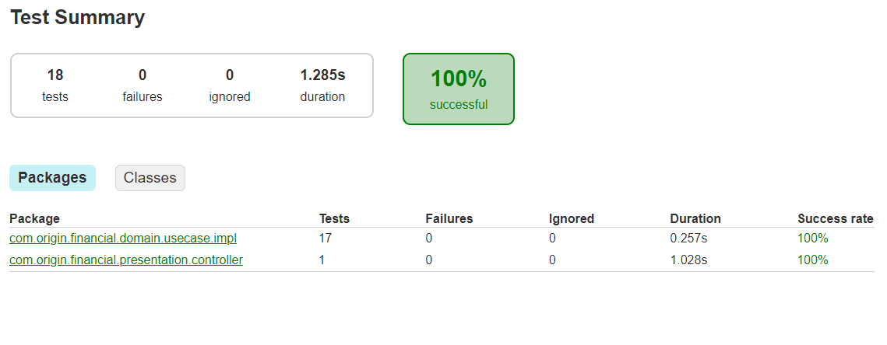

Project Structure
=================

In this project I'm appling some key points from [Clean Architecture](https://blog.cleancoder.com/uncle-bob/2012/08/13/the-clean-architecture.html) and some concepts that I consider important focusing on the requirements described in the topic [Criteria](#Criteria). I'm not following all the concepts "by the book", but focusing on what makes sense for the project, given its size and requirements (avoiding over engineering).

I'm also applying some architectural principles like [SOLID](https://www.baeldung.com/solid-principles) (only what applies), [KISS](https://www.interaction-design.org/literature/article/kiss-keep-it-simple-stupid-a-design-principle) and [DRY](https://pt.wikipedia.org/wiki/Don%27t_repeat_yourself) which I consider important in a project where we are looking for code quality, simplicity, readability, maintainability.

Domain Layer
------------

The ``Domain`` contains all the application's business logic and is ``isolated`` from the "outside world". Here, we expose de Business rules throughout ``interfaces`` ([Ports](http://wiki.c2.com/?PortsAndAdaptersArchitecture)), avoiding exposing the implementation details. The classes in this Layer don't know who is calling and don't have references for external dependencies.

```

 /
 └── src
     └── main
         ├── java
         │    └── com.origin.financial
         │        ├── ...
         │            ...
         │        ├── domain
         │            ├── model
         │            │   └── ...
         │            └── usecase
         │                └── impl
         │                └── ...
         │        ├── ...
         test
         └── java
             └── com.origin.financial
                 ├── domain.usecase.impl
                 │   └── ...
                 ...
```

| Package                           | Description                                                     |
| --------------------------------- |:----------------------------------------------------------------|
| model                             |  The ``model`` package holds the Entities with the  Business rules. As described in the article described by Uncle Bob ([click here](https://blog.cleancoder.com/uncle-bob/2012/08/13/the-clean-architecture.html#entities)) the Entities contains the ``most general high-level rules``. For example, the [Customer](https://github.com/ads1986/backend-challenges-solutions/blob/main/origin-financial/backend-take-home-assigment/src/main/java/com/origin/financial/domain/model/Customer.java) class has the fields which data is stored and the methods with all the rules related to the customer. We can see this in the ``hasAgeAboveSixty()`` method, that will return true if the customer is more than 60 years old.  Rather than repeat the same code throughout the application, we respect the principles [DRY (Don’t Repeat Yourself)](https://pt.wikipedia.org/wiki/Don%27t_repeat_yourself) and [Single Responsability](https://www.baeldung.com/solid-principles#s) centralizing the rule in a single point. |
| usecase                           |  The ``usecase`` package holds the classes with application specific business rules, in other words, the classes here shows "what the application do". For example, the class [ProcessHomeInsuranceImpl](https://github.com/ads1986/backend-challenges-solutions/blob/main/origin-financial/backend-take-home-assigment/src/main/java/com/origin/financial/domain/usecase/impl/ProcessHomeInsuranceImpl.java)  has the rules to process an insurance for a Home and this funcionality is exposed by the [ProcessHomeInsurance](https://github.com/ads1986/backend-challenges-solutions/blob/main/origin-financial/backend-take-home-assigment/src/main/java/com/origin/financial/domain/usecase/ProcessHomeInsurance.java) interface, following the [Dependency Inversion](https://www.baeldung.com/solid-principles#d) principle. |
| tests (Unit Tests)                |  The ``tests`` (being more specific ``test.java.com.origin.financial.domain.usecase.impl``) package has the classes for the Unit Tests. Here we test what is realy necessary, in this case, we are testing all types of insurances (a class for each usecase). |

** In the [Clean Architecture](https://blog.cleancoder.com/uncle-bob/2012/08/13/the-clean-architecture.html) in [Use Cases](https://blog.cleancoder.com/uncle-bob/2012/08/13/the-clean-architecture.html#use-cases) and [Entities](https://blog.cleancoder.com/uncle-bob/2012/08/13/the-clean-architecture.html#entities), we expect that external changes like databases, UI, or frameworks don't affects this Layers. In this project, I´m using Spring Boot that holds all Spring ecosystem. To avoid the framework dependency, rather than use [@Component](https://docs.spring.io/spring-framework/docs/current/javadoc-api/org/springframework/stereotype/Component.html) notation to provide [Dependency Inversion](https://www.baeldung.com/solid-principles#d), I use [@Named](https://docs.oracle.com/javaee/7/api/javax/inject/Named.html) notation provided by [JSR-330](https://docs.oracle.com/cd/E19798-01/821-1841/gjxvg/index.html) Java specification, that is implemented by others java frameworks like : [Guice](https://github.com/google/guice), [Micronaut](https://micronaut.io/), [Quarkus](https://quarkus.io/) and others. This approach allow that we can use any framework without affect the Domain Layer with a minimum effort.

Presentation Layer
-------------

The ``Presentation`` contains the classes that will interact with the "external users" to provide the applications funcionality. In this project, we are exposing a REST API as an entry point to access the funcionalty properly.

```

 /
 └── src
     └── main
         ├── java
         │    └── com.origin.financial
         │        ├── presentation
         │            ├── controller
         │            │   └── ...
         │            └── request
         │                └── ...
         test
         └── java
             └── com.origin.financial
                 ├── presentation.controller
                 │   └── ...
                 ...
```

| Package                           | Class                                                            |
| --------------------------------- |:----------------------------------------------------------------|
| controller                        | The ``controller`` package holds the classes we use to expose functionality through a REST API. For example, the class [InsuranceController](https://github.com/ads1986/backend-challenges-solutions/blob/main/origin-financial/backend-take-home-assigment/src/main/java/com/origin/financial/presentation/controller/InsuranceController.java) exposes the API ``[POST] /insurance/profile``. |
| tests (Integrated Tests)          |  The ``tests`` (been more specific ``test.java.com.origin.financial.presentation.controller``) package has the classes for the Integrated Tests. Here we test the complete functionality, in other words, thinking with the users point of view. |

Config Layer
-----------------

The ``Config`` layer has the classes that support the general configurations of the application.

```

 /
 └── src
     └── main
         ├── java
         │    └── com.origin.financial
         │        ├── config
         │            ├── exception
         │            │   └── ...
         │            ...
         │        ├── ...
         ...
```

| Appication                        | Class                                                            |
| --------------------------------- |:----------------------------------------------------------------|
| config                            | For exemple, we have the class [CustomResponseEntityExceptionHandler](https://github.com/ads1986/backend-challenges-solutions/blob/main/origin-financial/backend-take-home-assigment/src/main/java/com/origin/financial/config/CustomResponseEntityExceptionHandler.java) that handle exceptions thrown by the API, for example, when validating mandatory fields, expected values e etc. |

Configuration
=============

1. After clone the repository, access the project's root folder and run the command bellow:

```bash
   $ gradlew bootRun
```

> :warning: **Java 11 ou greater is necessary**: Check before run the app

2. To test the code, just run the following command :

```bash
   $ gradlew test --info
```

> :warning: **Testing Report**: To access the report, open the file "...\build\reports\tests\test"\index.html" in the projects´s root folder (use any Browser)



Usage
=====

To validate the API endpoint, I provide a Postman project in the endpoints folder. See below : 

```bash
endpoints
└── Insurance.postman_collection.json
```

# Origin Backend Take-Home Assignment
Origin offers its users an insurance package personalized to their specific needs without requiring the user to understand anything about insurance. This allows Origin to act as their *de facto* insurance advisor.

Origin determines the user’s insurance needs by asking personal & risk-related questions and gathering information about the user’s vehicle and house. Using this data, Origin determines their risk profile for **each** line of insurance and then suggests an insurance plan (`"economic"`, `"regular"`, `"responsible"`) corresponding to her risk profile.

For this assignment, you will create a simple version of that application by coding a simple API endpoint that receives a JSON payload with the user information and returns her risk profile (JSON again) – you don’t have to worry about the frontend of the application.

## The input
First, the would-be frontend of this application asks the user for her **personal information**. Then, it lets her add her **house** and **vehicle**. Finally, it asks her to answer 3 binary **risk questions**. The result produces a JSON payload, posted to the application’s API endpoint, like this example:

```JSON
{
  "age": 35,
  "dependents": 2,
  "house": {"ownership_status": "owned"},
  "income": 0,
  "marital_status": "married",
  "risk_questions": [0, 1, 0],
  "vehicle": {"year": 2018}
}
```

### User attributes
All user attributes are required:

- Age (an integer equal or greater than 0).
- The number of dependents (an integer equal or greater than 0).
- Income (an integer equal or greater than 0).
- Marital status (`"single"` or `"married"`).
- Risk answers (an array with 3 booleans).

### House
Users can have 0 or 1 house. When they do, it has just one attribute: `ownership_status`, which can be `"owned"` or `"mortgaged"`.

### Vehicle
Users can have 0 or 1 vehicle. When they do, it has just one attribute: a positive integer corresponding to the `year` it was manufactured.

## The risk algorithm
The application receives the JSON payload through the API endpoint and transforms it into a *risk profile* by calculating a *risk score* for each line of insurance (life, disability, home & auto) based on the information provided by the user.

First, it calculates the *base score* by summing the answers from the risk questions, resulting in a number ranging from 0 to 3. Then, it applies the following rules to determine a *risk score* for each line of insurance.

1. If the user doesn’t have income, vehicles or houses, she is ineligible for disability, auto, and home insurance, respectively.
2. If the user is over 60 years old, she is ineligible for disability and life insurance.
3. If the user is under 30 years old, deduct 2 risk points from all lines of insurance. If she is between 30 and 40 years old, deduct 1.
4. If her income is above $200k, deduct 1 risk point from all lines of insurance. 
5. If the user's house is mortgaged, add 1 risk point to her home score and add 1 risk point to her disability score. 
6. If the user has dependents, add 1 risk point to both the disability and life scores. 
7. If the user is married, add 1 risk point to the life score and remove 1 risk point from disability. 
8. If the user's vehicle was produced in the last 5 years, add 1 risk point to that vehicle’s score.

This algorithm results in a final score for each line of insurance, which should be processed using the following ranges:

- **0 and below** maps to **“economic”**.
- **1 and 2** maps to **“regular”**.
- **3 and above** maps to **“responsible”**.


## The output
Considering the data provided above, the application should return the following JSON payload:

```JSON
{
    "auto": "regular",
    "disability": "ineligible",
    "home": "economic",
    "life": "regular"
}
```

## Criteria
You may use any language and framework provided that you build a solid system with an emphasis on code quality, simplicity, readability, maintainability, and reliability, particularly regarding architecture and testing. We'd prefer it if you used Python, but it's just that – a preference.

Be aware that Origin will mainly take into consideration the following evaluation criteria:
* How clean and organized your code is;
* If you implemented the business rules correctly;
* How good your automated tests are (qualitative over quantitative).

Other important notes:
* Develop a extensible score calculation engine
* Add to the README file: (1) instructions to run the code; (2) what were the main technical decisions you made; (3) relevant comments about your project 
* You must use English in your code and also in your docs

This assignment should be doable in less than one day. We expect you to learn fast, **communicate with us**, and make decisions regarding its implementation & scope to achieve the expected results on time.

It is not necessary to build the screens a user would interact with, however, as the API is intended to power a user-facing application, we expect the implementation to be as close as possible to what would be necessary in real-life. Consider another developer would get your project/repository to evolve and implement new features from exactly where you stopped. 